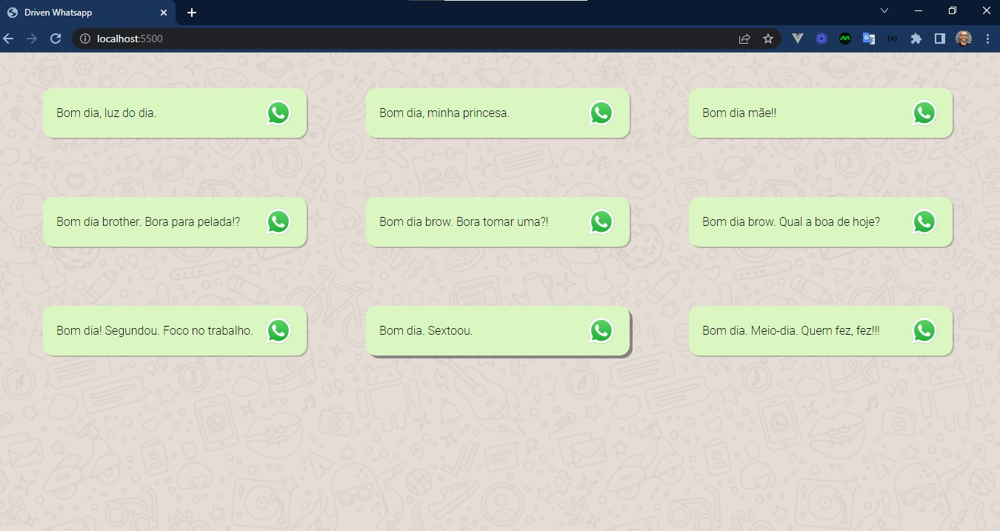
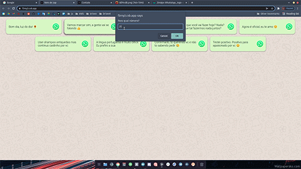
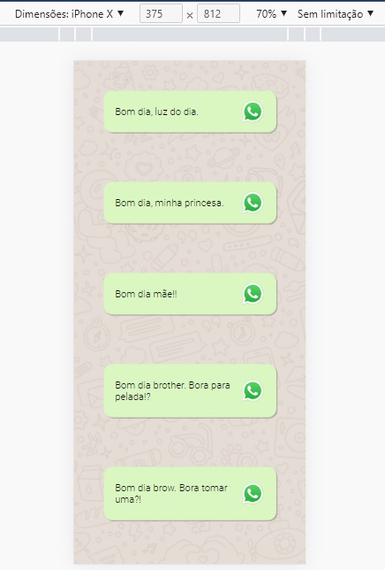

<h1 align="center">
    
</h1>

<h4 align="center"> 
	🚧 Whatsapp Messages 🚀
</h4> 

### 💻 Sobre o projeto

- Desenvolver um Disparador Automático de Frases no Whatsapp com html, css e javascript.
- Utilizar o template do layout a seguir para construir.

  

- O fluxo da aplicação é a seguinte:

  

### 🛠 Construindo 

- Utilizado a ferramento online para desenvolver Codesandbox junto com o inspecionar do Google Chrome.
- Acredito que o css se demonstra ser o principal fator para essa aplicação:
- border-radius para dar o efeito nas quinas das divs
- border-shadow para dar o efeito de sombra com sensação de profundidade
- div:hover para dar o efeito de destaque quando passar o mouse sobre a div
- para as divs se comportarem de forma a se ajustarem conforme o tamanho do dispositivo que está exibindo utilizar no body o display com flex e o flex-wrap com wrap.
- justify-content: center para alinhar horizontalmente
- background-image: url("") para inserir uma imagem como fundo
- font google para exibir uma fonte diferente
- Dar vida a aplicação com o javascript no arquivo `main.js`:
- para funcionar o javascript usar a tag script ao final do body
- usar a propriedade onclick nas divs para dar ação de botão para cada mensagem
- usar `this` como parâmetro na chamada da função nas divs para passar esse objeto html para o javascript manipular.
- usar o `firstElementChild` no elemento recebido na função para entender que estamos manipulando o `
` que contém o texto da mensagem que queremos pois é o primeiro elemento filho da div em questão.
- usar `innerText` para pegar o texto do elemento exibido da mensagem
- A próxima parte da nossa aplicação é saber qual é o número que estamos enviando a mensagem via whatsapp.
- prompt é do javascript e exibirá mensagem no navegador e também retornará o conteúdo que desejamos.
- O Whatsapp disponibiliza uma api que permite manipular algumas ações com o aplicativo. Nós utilizaremos a url: `https://api.whatsapp.com/send?phone=55${numberDestination}&text=${messageText}`.
- Para encerrar nossa aplicação, vamos abrir uma aba na url do whatsapp com as informações que desejamos: o número destino e a mensagem que clicamos sobre com o trecho `window.open(url)` 
- Hospedado aplicação no servidor Github Page

### 😯 Finalizado 

- Terminamos o desafio da driven. Muito massa. Vamos para o próximo.

  
  

### 🧭 Adicionado

- Validação da chamada da URL: preenchimento de número.

### 💻 Próximo passo

- estudar a API do Whatsapp
- criar novas funcionalidades dinâmicas a partir das informações públicas da API

---  

Feito com ❤️ por Douglas A B Novato 👋🏽 [Entre em contato!](https://www.linkedin.com/in/douglasabnovato/)
